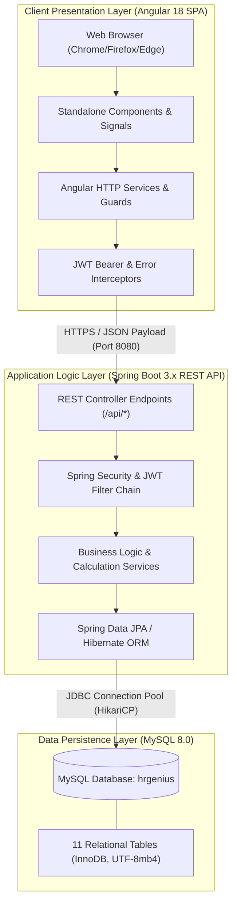
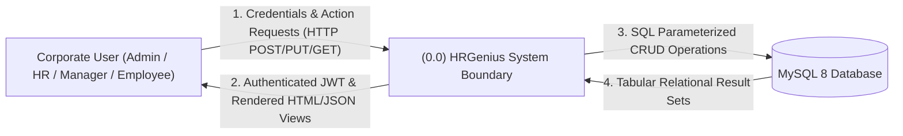
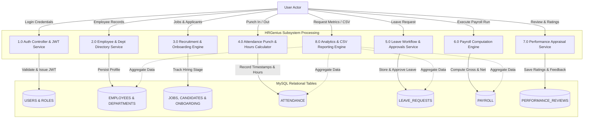
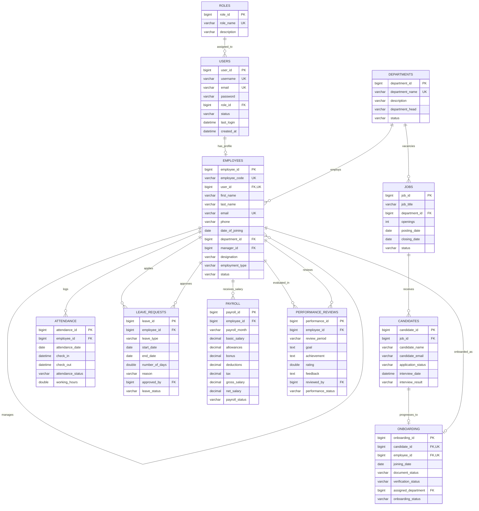
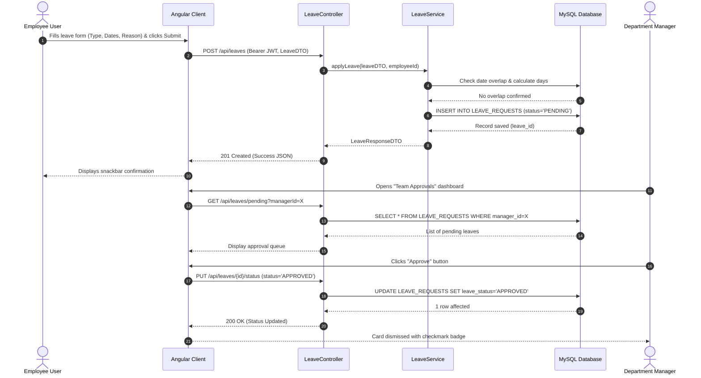
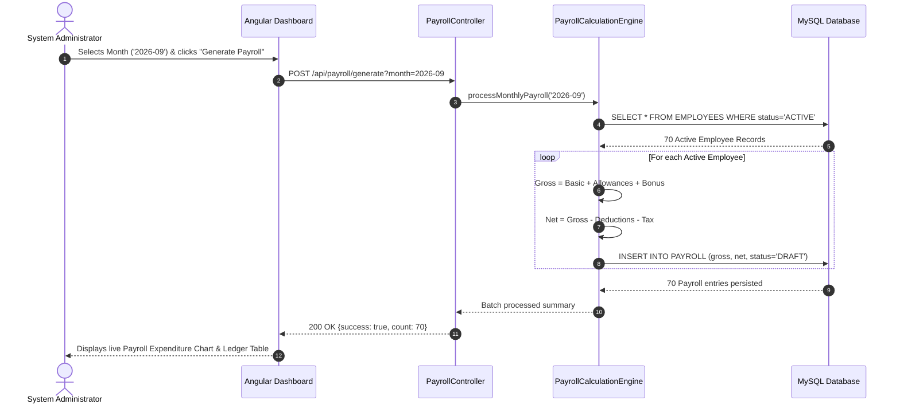

# DEPARTMENT OF COMPUTER SCIENCE & ENGINEERING
## ABES ENGINEERING COLLEGE, GHAZIABAD

---

# SOFTWARE REQUIREMENTS SPECIFICATION (SRS)
### **Project Title:** HRGenius: Enterprise Human Resource Management System (HRMS)
*Employee Lifecycle Administration, Recruitment Pipeline, Attendance Punch Clock, Multi-Tier Leave Management, Automated Payroll Processing, Performance Appraisals, and Real-Time Workforce Analytics*

**Standard Academic Compliance:** IEEE Std 830-1998 Recommended Practice for Software Requirements Specifications

---

| **METRIC** | **ACADEMIC SPECIFICATION** |
| :--- | :--- |
| **Submitted By** | **Pari Varshney** |
| **University Roll No.** | **2400320100785** |
| **Degree / Course** | Bachelor of Technology (B.Tech) in Computer Science & Engineering |
| **Academic Year** | 2026 – 2027 |
| **Project Status** | 3rd Year B.Tech Technical Project Baseline |
| **Department** | Department of Computer Science & Engineering |
| **Institution** | ABES Engineering College, Ghaziabad, Uttar Pradesh, India |
| **Date of Submission** | October 1, 2026 |
| **Supervisory Panel** | Project Coordinator / Evaluation Committee |

---

## Document Revision & Approval History

| Version | Release Date | Primary Changes / Milestone Description | Prepared By | Reviewed & Approved By |
| :---: | :---: | :--- | :--- | :--- |
| **0.1** | 15-Sep-2026 | Initial problem formulation, system boundary definition, and module scope. | Pari Varshney | Project Coordinator |
| **0.5** | 24-Sep-2026 | Architecture design: Spring Boot backend, MySQL 8 schema, Angular 18 frontend. | Pari Varshney | Department Guide |
| **1.0** | 30-Sep-2026 | Complete IEEE 830-1998 specification, DFDs, ERD, Use Case & Sequence models. | Pari Varshney | Project Evaluation Panel |
| **1.1** | 01-Oct-2026 | Finalized production UI redesign (Dusty Rose #BE5670 & Warm Stone) & MySQL persistence. | Pari Varshney | HOD / Academic Committee |

---

## Table of Contents
1. [Introduction](#1-introduction)
   - 1.1 [Purpose](#11-purpose)
   - 1.2 [Scope of the System](#12-scope-of-the-system)
   - 1.3 [Definitions, Acronyms, and Abbreviations](#13-definitions-acronyms-and-abbreviations)
   - 1.4 [References](#14-references)
   - 1.5 [Document Overview](#15-document-overview)
2. [Overall Description](#2-overall-description)
   - 2.1 [Product Perspective & Architectural Context](#21-product-perspective--architectural-context)
   - 2.2 [User Classes and Role Hierarchy](#22-user-classes-and-role-hierarchy)
   - 2.3 [Operating & Deployment Environment](#23-operating--deployment-environment)
   - 2.4 [Design and Implementation Constraints](#24-design-and-implementation-constraints)
   - 2.5 [Assumptions and Dependencies](#25-assumptions-and-dependencies)
3. [System Features and Functional Requirements](#3-system-features-and-functional-requirements)
   - 3.1 [Module 1: Authentication & Role-Based Access Governance](#31-module-1-authentication--role-based-access-governance)
   - 3.2 [Module 2: Department & Organizational Structure](#32-module-2-department--organizational-structure)
   - 3.3 [Module 3: Employee Lifecycle & Directory Administration](#33-module-3-employee-lifecycle--directory-administration)
   - 3.4 [Module 4: Talent Acquisition & Recruitment Pipeline](#34-module-4-talent-acquisition--recruitment-pipeline)
   - 3.5 [Module 5: Candidate Onboarding & Background Verification](#35-module-5-candidate-onboarding--background-verification)
   - 3.6 [Module 6: Time & Attendance Tracking (Punch Clock)](#36-module-6-time--attendance-tracking-punch-clock)
   - 3.7 [Module 7: Leave Application & Multi-Tier Approvals](#37-module-7-leave-application--multi-tier-approvals)
   - 3.8 [Module 8: Payroll Processing & Payslip Generation](#38-module-8-payroll-processing--payslip-generation)
   - 3.9 [Module 9: Performance Appraisals & Goal Tracking](#39-module-9-performance-appraisals--goal-tracking)
   - 3.10 [Module 10: Executive Analytics & Audit CSV Export](#310-module-10-executive-analytics--audit-csv-export)
   - 3.11 [Module 11: Theme & Visual Accessibility Management](#311-module-11-theme--visual-accessibility-management)
4. [External Interface Requirements](#4-external-interface-requirements)
   - 4.1 [User Interfaces (UI/UX Design Rules)](#41-user-interfaces-uiux-design-rules)
   - 4.2 [Hardware Interfaces](#42-hardware-interfaces)
   - 4.3 [Software Interfaces](#43-software-interfaces)
   - 4.4 [Communication Interfaces](#44-communication-interfaces)
5. [Non-Functional Requirements (NFRs)](#5-non-functional-requirements-nfrs)
   - 5.1 [Performance Metrics](#51-performance-metrics)
   - 5.2 [Security & Data Integrity](#52-security--data-integrity)
   - 5.3 [Reliability & Fault Tolerance](#53-reliability--fault-tolerance)
   - 5.4 [Portability, Responsiveness & Accessibility](#54-portability-responsiveness--accessibility)
6. [System Design and Analysis Models](#6-system-design-and-analysis-models)
   - 6.1 [UML Use Case Diagram](#61-uml-use-case-diagram)
   - 6.2 [Data Flow Diagrams (DFD Level 0 & Level 1)](#62-data-flow-diagrams-dfd-level-0--level-1)
   - 6.3 [Entity-Relationship Diagram (ERD - MySQL 3NF)](#63-entity-relationship-diagram-erd---mysql-3nf)
   - 6.4 [UML Sequence Diagrams (Core Workflows)](#64-uml-sequence-diagrams-core-workflows)
7. [Academic Verification & Supervisory Sign-Off](#7-academic-verification--supervisory-sign-off)

---

# 1. Introduction

### 1.1 Purpose
The purpose of this Software Requirements Specification (SRS) is to establish an exhaustive, rigorous, and unambiguous software engineering contract for **HRGenius (Enterprise Human Resource Management System)**. This document specifies the functional capabilities, behavioral workflows, non-functional performance benchmarks, relational database schema, system interfaces, and UML/DFD models governing the software.

This specification serves as the formal academic baseline for 3rd-year Bachelor of Technology evaluation in the Department of Computer Science & Engineering at **ABES Engineering College, Ghaziabad**.

### 1.2 Scope of the System
HRGenius is an integrated, full-stack, cloud-ready Human Resource Management System engineered to eliminate paper-based documentation, fragmented record keeping, and unmonitored approval lifecycles across modern corporate enterprises.

#### In-Scope Functional Capabilities:
1. **Centralized Identity & Access Management:** Stateless JSON Web Token (JWT) authentication, password hashing via BCrypt, and 4-tier Role-Based Access Control (RBAC: `ADMIN`, `HR`, `MANAGER`, `EMPLOYEE`).
2. **Organizational Hierarchy & Employee Directory:** Complete CRUD on departments, designations, direct supervisor linkages, and employee profile lifecycles.
3. **End-to-End Talent Acquisition:** Job vacancy publishing, applicant tracking through stages (`Applied` $\to$ `Shortlisted` $\to$ `Interviewed` $\to$ `Selected` $\to$ `Rejected`), and onboarding transitions.
4. **Time & Shift Attendance:** Digital punch in/out with automatic working hours computation (`check_out - check_in`) and daily status evaluation (`Present`, `Late`, `Half-day`, `Absent`).
5. **Multi-Tier Leave Governance:** Time-off requests with real-time balance checks, manager approval/rejection queues, and conflict mitigation.
6. **Automated Payroll Engine:** Statutory gross-to-net salary computation using formal compensation formulas:
   $$\text{Gross Salary} = \text{Basic} + \text{Allowances} + \text{Bonus}$$
   $$\text{Net Salary} = \text{Gross Salary} - (\text{Deductions} + \text{Tax})$$
   along with printable audit payslips.
7. **Performance Appraisals:** Quarterly performance goals, achievements submission, 1-to-5 star ratings, and manager qualitative feedback.
8. **Business Intelligence & Audit Reporting:** Live 6-chart analytical dashboard and 1-click CSV datasets export for external audit compliance.
9. **Accessible Dual-Theme UI:** High-contrast, calm minimal frontend conforming to WCAG 2.1 AA using a two-colour brand palette (Dusty Rose `#BE5670` & Warm Stone Neutrals) with light/dark toggling.

#### Out-of-Scope Boundaries:
- Real-world banking wire transfers / direct payment gateway settlement (mock transaction disbursement simulation is utilized).
- Physical biometric fingerprint scanner hardware drivers (REST API supports clock-in/out integration).
- Multi-tenant enterprise SaaS billing billing systems.

#### Key Business & Operational Benefits:
- **Operational Speed:** Reduces administrative processing turnaround for leaves, onboarding, and payroll generation by over 70%.
- **Zero Calculation Error:** Guarantees deterministic, reproducible payroll calculation and attendance hour tabulation.
- **Audit Preparedness:** Every record is tracked with `created_at` and `updated_at` timestamps in MySQL with foreign key cascading rules.

---

### 1.3 Definitions, Acronyms, and Abbreviations

| Acronym / Term | Technical Definition |
| :--- | :--- |
| **SRS** | Software Requirements Specification (formulated under IEEE Std 830-1998). |
| **HRMS** | Human Resource Management System. |
| **API** | Application Programming Interface (HTTP/RESTful endpoints exchanging JSON). |
| **JWT** | JSON Web Token (RFC 7519 signed stateless authorization token). |
| **RBAC** | Role-Based Access Control (`ADMIN`, `HR`, `MANAGER`, `EMPLOYEE`). |
| **CRUD** | Create, Read, Update, Delete database persistence operations. |
| **REST** | Representational State Transfer software architectural style. |
| **ORM** | Object-Relational Mapping (Spring Data JPA / Hibernate 6). |
| **SPA** | Single-Page Application (Angular 18 architecture with client-side routing). |
| **CORS** | Cross-Origin Resource Sharing (whitelisted communication between Port 4200 and Port 8080). |
| **BCrypt** | Adaptive cryptographic password hashing function with salted key derivation. |
| **DFD** | Data Flow Diagram (modeling structural flow of data entities). |
| **ERD** | Entity-Relationship Diagram (representing relational schema in 3NF). |
| **LCP / INP** | Largest Contentful Paint / Interaction to Next Paint (Core Web Vitals). |

---

### 1.4 References
1. **IEEE Std 830-1998:** *IEEE Recommended Practice for Software Requirements Specifications*, IEEE Computer Society, 1998.
2. **Ian Sommerville:** *Software Engineering (10th Edition)*, Pearson Education, 2015.
3. **Spring Boot Framework Documentation:** Spring Framework 6.x and Spring Boot 3.x, Pivotal Software / VMware Tanzu.
4. **Angular Official Documentation:** Angular 18 Framework, Component Router, Signals & Reactive Forms, Google Inc.
5. **MySQL 8.0 Reference Manual:** Relational Database Engine, InnoDB Storage Engine, ACID compliance, Oracle Corporation.
6. **Chart.js Documentation:** Reactive HTML5 Canvas Data Visualization Library, Version 4.x.
7. **W3C Web Content Accessibility Guidelines (WCAG) 2.1:** Contrast Ratio $\ge 4.5:1$ specifications.

---

### 1.5 Document Overview
* **Section 2** specifies system architecture, user personas, operating environments, hardware/software constraints, and operating assumptions.
* **Section 3** details the 11 functional modules with exhaustive requirement tables (FR IDs, inputs, processing rules, priority).
* **Section 4** outlines external hardware, software, user, and communication interfaces.
* **Section 5** enumerates verifiable Non-Functional Requirements (Performance, Security, Reliability, Portability).
* **Section 6** delivers formal engineering modeling diagrams (UML Use Case, DFD Level 0, DFD Level 1, Crow's Foot ERD, and Sequence Diagrams).
* **Section 7** contains the formal Academic Supervisory Review and Sign-Off block.

---

# 2. Overall Description

### 2.1 Product Perspective & Architectural Context
HRGenius follows a decoupled **Three-Tier Client-Server Enterprise Architecture**:
1. **Presentation Tier (Client):** Single Page Application built on Angular 18, Angular Material 18, and Chart.js. Communicates asynchronously via HTTP client interceptors sending Bearer JWT tokens.
2. **Application Logic Tier (Server):** Spring Boot 3.x REST application written in Java 17. Encapsulates business services, spring security filters, DTO validators, and transaction management (`@Transactional`).
3. **Data Persistence Tier (Storage):** Relational MySQL 8.0 database engine executing under InnoDB, enforcing ACID transactions, foreign keys, unique indices, and automatic seed verification.

---

### 2.2 User Classes and Role Hierarchy
The system enforces strict Role-Based Access Control (RBAC). Access to UI routes and backend API endpoints is partitioned across four primary user personas:

| User Class / Persona | Technical Competence | Administrative Scope & Authorization Rights |
| :--- | :--- | :--- |
| **System Administrator** (`ADMIN`) | High | Global administrative authority. Manages departments, provisions employee records and user credentials, assigns manager hierarchy, executes batch payroll, and accesses audit reports. |
| **HR Specialist** (`HR`) | High | Operational workforce manager. Manages job postings, candidates, interview evaluation, employee onboarding verification, leave allocations, and company-wide attendance audits. |
| **Department Manager** (`MANAGER`) | Intermediate | Supervisory authority over assigned direct reports. Reviews team attendance logs, approves/rejects team leave requests, and conducts quarterly performance appraisals with ratings. |
| **Employee** (`EMPLOYEE`) | Basic to Intermediate | Self-service portal user. Records daily attendance check-in/out, applies for time-off, reviews historical leave status, downloads monthly payslips, and submits appraisal goals. |

#### Role-Based Functional Permissions Matrix:

| Feature / Subsystem | `ADMIN` | `HR` | `MANAGER` | `EMPLOYEE` |
| :--- | :---: | :---: | :---: | :---: |
| **User & Role Administration** | **Full (CRUD)** | Read Only | None | None |
| **Department Management** | **Full (CRUD)** | Read Only | Read Only | Read Only |
| **Employee Directory** | **Full (CRUD)** | **Full (CRUD)** | Direct Reports Only | Self Profile Only |
| **Jobs & Candidate Pipeline** | Read Only | **Full (CRUD)** | Interview Access | None |
| **Onboarding Processing** | Read Only | **Full (CRUD)** | Assigned Hires | None |
| **Attendance Punching** | System View | System View | Team View | **Personal Punch** |
| **Leave Application** | Personal Apply | Personal Apply | Personal Apply | **Personal Apply** |
| **Leave Approval Queue** | Override All | Override All | **Direct Reports** | None |
| **Payroll Generation** | **Execute All** | View All | None | Personal Payslips |
| **Performance Review** | System View | System View | **Grade & Review** | Submit Self Goal |
| **Analytics & Data Export** | **Full Export** | **Full Export** | Team Metrics | Personal Summary |

---

### 2.3 Operating & Deployment Environment

#### 1. Client-Side Browser Environment:
* Modern standards-compliant web browsers: Google Chrome $\ge$ 110, Mozilla Firefox $\ge$ 108, Microsoft Edge $\ge$ 110, Apple Safari $\ge$ 16.
* Display resolutions supported: Desktop (1920$\times$1080, 1440$\times$900, 1366$\times$768), Tablet (1024$\times$768, 768$\times$1024), Responsive Mobile down to 360$\times$640.

#### 2. Backend Application Server Environment:
* Operating System: Linux (Ubuntu 22.04 LTS / Debian 12) or Microsoft Windows 10/11 / Windows Server.
* Java Runtime: Java Development Kit (OpenJdk / Oracle JDK) version 17 LTS.
* Build Tool: Apache Maven 3.9+ (bundled `mvnw.cmd` / `./mvnw`).
* Web Servlet Container: Embedded Apache Tomcat 10.1 (executing on Port `8080`).

#### 3. Database Server Tier:
* Database Engine: MySQL Community Server version 8.0+.
* Storage Engine: InnoDB (row-level locking, foreign keys, UTF-8mb4 character set, `utf8mb4_unicode_ci` collation).
* Optional Profile: In-memory H2 database for offline test isolation (`application-h2.yml`).

---

### 2.4 Design and Implementation Constraints
1. **Academic Budget & Zero Cloud Cost:** Built entirely on open-source frameworks (Angular, Spring Boot, MySQL) without reliance on commercial proprietary APIs.
2. **Stateless Authentication:** Spring Security enforces stateless session management (`SessionCreationPolicy.STATELESS`). No HTTP session state is stored on the server; every request is authenticated via the `Authorization: Bearer <token>` header.
3. **Database Security:** Plain-text passwords are never stored. Passwords are encrypted using the BCrypt adaptive hashing algorithm (work factor 10).
4. **Idempotent Data Seeding:** The backend `DatabaseSeeder` checks database record counts prior to insertion, guaranteeing that repeated application restarts never duplicate data.
5. **Two-Color UI Strict Rule:** The frontend layout strictly permits only two color palettes: Dusty Rose (`#BE5670`, `#A8435D`, `#D9788F`) and Warm Stone neutrals. Multi-color rainbow badges are strictly forbidden.
6. **Data Naming Conventions:** All backend JSON DTO attributes follow `snake_case` serialization matching relational column schemas.

---

### 2.5 Assumptions and Dependencies
1. **Network Connectivity:** Client workstations maintain TCP/IP connectivity to the server host at `http://localhost:8080` (or configured LAN IP).
2. **Clock Synchronization:** Client and server clocks are synchronized via NTP to maintain accurate attendance check-in/out timestamps and leave interval validation.
3. **Pre-Existing Database:** The MySQL database schema `hrgenius` exists and the connection credentials are provided via environment variables (`DB_USER`, `DB_PASSWORD`).

---

# 3. System Features and Functional Requirements

### 3.1 Module 1: Authentication & Role-Based Access Governance
* **Description:** Manages identity verification, cryptographic session generation, and permission boundary enforcement.

| Requirement ID | Functional Feature | Input Parameters / Validation Rules | Execution Logic | Priority |
| :--- | :--- | :--- | :--- | :---: |
| **FR-1.1** | Secure User Login | `username` (string, required), `password` (string, required). | Verifies user existence, checks `status == 'ACTIVE'`, matches password via BCrypt. Returns JWT, role, user ID, employee ID. | **High** |
| **FR-1.2** | JWT Token Generation | Validated `UserPrincipal`. | Issues signed HS256 JWT containing username, role claim, issued timestamp, and 24-hour expiration time. | **High** |
| **FR-1.3** | Role Mapping & Guarding | Client route navigation event + HTTP request. | Interceptor attaches `Authorization: Bearer <token>`. Angular route guards inspect role and redirect unauthorized requests to `/login`. | **High** |
| **FR-1.4** | Session Termination | User click on Logout action. | Purges client token, user metadata from `localStorage`, terminates authentication state, and redirects to login view. | **Medium** |

---

### 3.2 Module 2: Department & Organizational Structure
* **Description:** Governs organizational business units and hierarchical departmental heads.

| Requirement ID | Functional Feature | Input Parameters / Validation Rules | Execution Logic | Priority |
| :--- | :--- | :--- | :--- | :---: |
| **FR-2.1** | Create Department | `department_name` (unique, max 100 chars), `description`, `department_head`. | Validates uniqueness, persists record with default status `ACTIVE`. | **High** |
| **FR-2.2** | Update Department | `department_id`, modified attributes, status (`ACTIVE`/`INACTIVE`). | Updates record; prevents deactivation if active employee dependencies exist. | **Medium** |
| **FR-2.3** | List Departments & Summary | Filter query parameters. | Returns list of departments along with aggregate active employee headcount. | **High** |

---

### 3.3 Module 3: Employee Lifecycle & Directory Administration
* **Description:** Manages master records, contact details, designations, and supervisory reporting lines.

| Requirement ID | Functional Feature | Input Parameters / Validation Rules | Execution Logic | Priority |
| :--- | :--- | :--- | :--- | :---: |
| **FR-3.1** | Employee Registration | `first_name`, `last_name`, `email` (unique), `date_of_birth`, `date_of_joining`, `department_id`, `designation`, `employment_type`. | Generates unique sequential `employee_code` (e.g., `EMP001`), creates matching user account, and links foreign keys. | **High** |
| **FR-3.2** | Employee Profile Update | `employee_id`, contact details, address, manager assignment. | Updates entity in MySQL; verifies that `manager_id` references a valid existing employee. | **High** |
| **FR-3.3** | Directory Search & Filters | Search keyword, department dropdown filter, status filter. | Executes paginated SQL query with multi-column filtering (`first_name`, `last_name`, `code`, `email`). | **High** |
| **FR-3.4** | Employee Termination | `employee_id`, termination reason. | Sets status to `INACTIVE`, updates associated user record status, and detaches active reporting lines. | **Medium** |

---

### 3.4 Module 4: Talent Acquisition & Recruitment Pipeline
* **Description:** Publishes vacancies and tracks job applicant progress through hiring stages.

| Requirement ID | Functional Feature | Input Parameters / Validation Rules | Execution Logic | Priority |
| :--- | :--- | :--- | :--- | :---: |
| **FR-4.1** | Job Vacancy Posting | `job_title`, `department_id`, `openings` ($\ge 1$), `posting_date`, `closing_date`, `requirements`. | Persists job record with status `OPEN`; validates that `closing_date > posting_date`. | **High** |
| **FR-4.2** | Candidate Application Entry | `job_id`, `candidate_name`, `candidate_email`, `phone`, `resume_url`. | Binds applicant to job record with initial status `APPLIED` and sets application date to current date. | **High** |
| **FR-4.3** | Candidate Stage Transition | `candidate_id`, `application_status` (`SHORTLISTED`, `INTERVIEWED`, `SELECTED`, `REJECTED`). | Updates stage; enables interview date and interviewer evaluation feedback capture. | **High** |
| **FR-4.4** | Recruitment Funnel Counts | `job_id` or company-wide. | Computes candidate count per recruitment stage for pipeline funnel visualization. | **Medium** |

---

### 3.5 Module 5: Candidate Onboarding & Background Verification
* **Description:** Facilitates transition of `SELECTED` candidates into formalized corporate staff.

| Requirement ID | Functional Feature | Input Parameters / Validation Rules | Execution Logic | Priority |
| :--- | :--- | :--- | :--- | :---: |
| **FR-5.1** | Initiate Onboarding | Candidate with status `SELECTED`, `joining_date`, `assigned_department`. | Spawns onboarding workflow record with document verification status `PENDING`. | **High** |
| **FR-5.2** | Document Verification Check | `onboarding_id`, document verification status (`VERIFIED`/`REJECTED`). | Logs verification state, flags incomplete credential submissions. | **Medium** |
| **FR-5.3** | Onboarding Finalization | `onboarding_id`, status $\to$ `COMPLETED`. | Automatically provisions new employee record in `EMPLOYEES` table and links `employee_id`. | **High** |

---

### 3.6 Module 6: Time & Attendance Tracking (Punch Clock)
* **Description:** Real-time daily work shift recording, automated hours tabulation, and status categorization.

| Requirement ID | Functional Feature | Input Parameters / Validation Rules | Execution Logic | Priority |
| :--- | :--- | :--- | :--- | :---: |
| **FR-6.1** | Daily Check-In Punch | Authenticated `employee_id`, current timestamp. | Verifies no existing punch for today. Persists `check_in` time. If check-in is after standard time (e.g., 09:30 AM), flags status as `LATE`. | **High** |
| **FR-6.2** | Daily Check-Out Punch | Authenticated `employee_id`, remarks (optional). | Sets `check_out` time, computes `working_hours = (check_out - check_in)` in hours, updates status to `PRESENT` (if $\ge 8$ hrs) or `HALF_DAY` (if $< 8$ and $\ge 4$ hrs). | **High** |
| **FR-6.3** | Monthly Attendance History | `employee_id`, month query parameter. | Fetches daily logs for current month, computing total shifts, late arrivals, half-days, and absences. | **High** |
| **FR-6.4** | Manager Attendance Inspection| Department ID, date selector. | Displays attendance status matrix of all direct reports for specified calendar day. | **Medium** |

---

### 3.7 Module 7: Leave Application & Multi-Tier Approvals
* **Description:** Formal time-off management with balance checking and manager approval workflows.

| Requirement ID | Functional Feature | Input Parameters / Validation Rules | Execution Logic | Priority |
| :--- | :--- | :--- | :--- | :---: |
| **FR-7.1** | Submit Leave Request | `employee_id`, `leave_type` (`SICK`, `CASUAL`, `EARNED`), `start_date`, `end_date`, `reason`. | Validates `start_date <= end_date`. Checks for overlapping active leaves. Calculates `number_of_days`. Sets status to `PENDING`. | **High** |
| **FR-7.2** | Pending Approvals Inbox | Authenticated `manager_id`. | Retrieves all pending leave requests submitted by direct reports assigned to this manager. | **High** |
| **FR-7.3** | Leave Decision Action | `leave_id`, action (`APPROVED`/`REJECTED`), reviewer comments. | Sets `leave_status`, populates `approved_by` and `approval_date`. Notifies employee profile. | **High** |
| **FR-7.4** | Organization Leave Calendar | Date range, department filter. | Returns schedule of approved employee leaves to avoid project staffing deficits. | **Low** |

---

### 3.8 Module 8: Payroll Processing & Payslip Generation
* **Description:** Mathematical salary computation, tax withholding, compensation auditing, and payslip generation.

| Requirement ID | Functional Feature | Input Parameters / Validation Rules | Execution Logic | Priority |
| :--- | :--- | :--- | :--- | :---: |
| **FR-8.1** | Batch Payroll Calculation | `payroll_month` (format `YYYY-MM`), department or all employees. | Computes gross salary: $\text{basic} + \text{allowances} + \text{bonus}$. Computes net salary: $\text{gross} - (\text{deductions} + \text{tax})$. Status `DRAFT`. | **High** |
| **FR-8.2** | Payroll Disbursement Approval | `payroll_id` or batch month. | Transition status from `DRAFT` $\to$ `PROCESSED` $\to$ `PAID`. Sets `payment_date`. | **High** |
| **FR-8.3** | Payslip Document Render | `payroll_id`, authenticated employee or HR. | Renders printable audit breakdown containing employee code, PAN/Tax, earnings list, and deductions. | **High** |
| **FR-8.4** | Salary History Ledger | `employee_id`. | Returns historical 12-month compensation records with monthly breakdown. | **Medium** |

---

### 3.9 Module 9: Performance Appraisals & Goal Tracking
* **Description:** Quarterly evaluation cycles, KPI deliverables tracking, and quantitative rating assessments.

| Requirement ID | Functional Feature | Input Parameters / Validation Rules | Execution Logic | Priority |
| :--- | :--- | :--- | :--- | :---: |
| **FR-9.1** | Appraisal Goal Definition | `employee_id`, `review_period` (e.g., `Q3-2026`), `goal` text. | Registers appraisal goal item in `DRAFT` state for current review cycle. | **High** |
| **FR-9.2** | Self-Achievement Submission | `performance_id`, `achievement` description text. | Allows employee to submit deliverables summary for manager evaluation. | **Medium** |
| **FR-9.3** | Manager Review & Rating | `performance_id`, `rating` (1.0 to 5.0 scale), `feedback` text. | Sets `reviewed_by = manager_id`, records review timestamp, and updates status to `COMPLETED`. | **High** |
| **FR-9.4** | Rating Spread Analysis | Department or organizational scope. | Generates histogram distribution of appraisal ratings (1-star through 5-star). | **Medium** |

---

### 3.10 Module 10: Executive Analytics & Audit CSV Export
* **Description:** High-level executive dashboard visualization and raw data export for regulatory audit compliance.

| Requirement ID | Functional Feature | Input Parameters / Validation Rules | Execution Logic | Priority |
| :--- | :--- | :--- | :--- | :---: |
| **FR-10.1** | High-Impact KPI Aggregation | System-wide live data. | Aggregates Total Active Employees, New Hires Onboarded, Open Job Positions, and Pending Leave Requests. | **High** |
| **FR-10.2** | 6 Visual Analytics Charts | Dynamic theme token (Light/Dark). | Renders Chart.js charts: Dept Headcount (Doughnut), Attendance Breakdown (Pie), Leave Status (Bar), Recruitment Funnel (Bar), Payroll Trend (Bar), Performance Spread (Bar). | **High** |
| **FR-10.3** | Live CSV Dataset Exports | Action click on Employees, Attendance, Leaves, Payroll, or Performance export. | Generates RFC 4180 compliant CSV stream containing all persisted records with column headers. | **Medium** |
| **FR-10.4** | Role-Tailored Highlights | Injected authenticated user role. | Displays custom employee punch status or manager team approvals queue. | **Medium** |

---

### 3.11 Module 11: Theme & Visual Accessibility Management
* **Description:** Persistent client-side theming conforming to minimal two-brand-color design principles.

| Requirement ID | Functional Feature | Input Parameters / Validation Rules | Execution Logic | Priority |
| :--- | :--- | :--- | :--- | :---: |
| **FR-11.1** | Light / Dark Theme Switching | User click on top-bar sun/moon toggle. | Updates `data-theme` attribute on `<html>`, persists preference in `localStorage`. Smooth 150ms transition. | **High** |
| **FR-11.2** | Anti-Flash Pre-Hydration | Document load event. | Inline script in `index.html` inspects `localStorage` or `prefers-color-scheme` before DOM paint to prevent white flash. | **High** |
| **FR-11.3** | Dynamic Chart Palette Update | Signal event from `ThemeService`. | Recalculates canvas gridlines, text colors, and bar tints to match active theme tokens without page reload. | **High** |

---

# 4. External Interface Requirements

### 4.1 User Interfaces (UI/UX Design Rules)
* **Design Philosophy:** Calm, professional, and minimal HR environment characterized by generous whitespace, subtle 1px borders, soft warm shadows, and restrained color usage.
* **Palette Specification:**
  * **Primary Accent:** Dusty Rose `#BE5670`. Hover/Darker: `#A8435D`. Dark mode accent: `#D9788F`. Soft tints: 8% (`rgba(190, 86, 112, 0.08)`) and 14% (`rgba(190, 86, 112, 0.14)`).
  * **Neutral Palette:** Warm stone scale (Light: `#FAF8F5`, `#FFFFFF`, `#F3EFEA`, `#292524`; Dark: `#171514`, `#221F1E`, `#2C2826`, `#F5F3EF`).
  * **Danger/Alerts:** `#B42318` used only for form errors and delete confirmations.
* **Component Standards:**
  * Inputs: 40px height, 8px border radius, clear Dusty Rose focus ring.
  * Cards: 12px border radius, 1px solid border, 20–24px interior padding.
  * Tables: Sticky headers, 52px comfortable row height, subtle row hover tint.
  * Buttons: Solid primary (Dusty Rose with white bold text), outlined secondary (warm border with text), text action buttons.

---

### 4.2 Hardware Interfaces
* **Client Workstations:** Standard personal computer, laptop, or mobile terminal equipped with minimum 2.0 GHz dual-core CPU, 4 GB RAM, and standard display monitor ($\ge 720\text{p}$).
* **Host / Server Node:** Minimum 2.4 GHz quad-core processor, 8 GB RAM, and 20 GB available SSD storage hosting JVM and MySQL server daemon.

---

### 4.3 Software Interfaces
* **Database Driver:** MySQL Connector/J (`com.mysql:mysql-connector-j:8.3+`) over standard JDBC protocol.
* **ORM & Data Layer:** Spring Data JPA with Hibernate 6.x executing parameterized SQL queries.
* **API Documentation Engine:** SpringDoc OpenAPI 3.0 / Swagger UI rendering live interactive endpoints at `/swagger-ui.html`.
* **Frontend HTTP Client:** Angular `provideHttpClient` utilizing functional interceptors for Bearer token insertion and error notifications via `MatSnackBar`.

---

### 4.4 Communication Interfaces
* **Protocol:** HTTP/1.1 and HTTPS (TLS 1.3 encryption on production deployment).
* **Payload Format:** UTF-8 encoded `application/json` data format across all REST endpoints.
* **Cross-Origin Configuration (CORS):** Backend `WebMvcConfigurer` explicitly authorizes requests from origin `http://localhost:4200` with headers `Authorization`, `Content-Type`, and HTTP methods `GET`, `POST`, `PUT`, `DELETE`, `OPTIONS`.

---

# 5. Non-Functional Requirements (NFRs)

### 5.1 Performance Metrics
* **Page Load Time:** Initial Single-Page Application bundle loads and renders interactive UI within **$< 1.8$ seconds** over broadband connections.
* **API Response Latency:** Standard transactional REST queries (e.g., employee search, punch clock, leave application) complete within **$< 350\text{ ms}$** under concurrent loads of up to 50 active users.
* **Database Optimization:** Indexed foreign keys on `department_id`, `employee_id`, and `manager_id` ensure query execution time stays under **$< 50\text{ ms}$**.

### 5.2 Security & Data Integrity
* **Cryptographic Storage:** Passwords are hashed with BCrypt. Plain-text credentials never touch persistent storage or application logs.
* **Stateless Token Integrity:** JWT signatures are validated on every incoming HTTP call. Tampered tokens trigger HTTP 401 Unauthorized.
* **SQL Injection Prevention:** 100% of database interactions are executed via Spring Data JPA parameterized queries and Hibernate prepared statements.
* **Role Verification:** Critical mutating endpoints (`/api/payroll/generate`, `/api/departments`) are defended by Spring Security `@PreAuthorize("hasRole('ADMIN')")`.

### 5.3 Reliability & Fault Tolerance
* **Transaction Rollback:** All multi-step service write operations are decorated with `@Transactional`, guaranteeing automatic rollback upon unhandled runtime exceptions.
* **System Availability:** Designed for $\ge 98\%$ uptime during academic evaluation periods.
* **Data Idempotency:** The database seeder verifies existing counts prior to execution, preventing duplicate records across server reboots.

### 5.4 Portability, Responsiveness & Accessibility
* **Cross-Platform Execution:** Backend runs platform-independently on any OS with Java 17. Frontend executes on any modern web browser.
* **Responsive Layout:** Adapts dynamically across screen widths from 360px mobile views up to 4K desktop displays using CSS Grid and Flexbox.
* **WCAG 2.1 AA Compliance:** All body text and button typography maintain a color contrast ratio of $\ge 4.5:1$ against their respective light and dark background surfaces.

---

# 6. System Design and Analysis Models

### 6.1 UML Use Case Diagram

```mermaid
graph TD
    %% Actors
    Admin((System Admin))
    HR((HR Specialist))
    Manager((Dept Manager))
    Employee((Employee))

    %% Use Cases
    UC_Login(["1.0 Authenticate & Login"])
    UC_Dept(["2.0 Manage Departments"])
    UC_Emp(["3.0 Manage Employees"])
    UC_Job(["4.0 Manage Jobs & Candidates"])
    UC_Onboard(["5.0 Manage Onboarding"])
    UC_Punch(["6.0 Clock In / Clock Out"])
    UC_LeaveApply(["7.0 Apply for Leave"])
    UC_LeaveApprove(["7.1 Review & Approve Leave"])
    UC_Payroll(["8.0 Process Monthly Payroll"])
    UC_Payslip(["8.1 View & Print Payslip"])
    UC_Goal(["9.0 Submit Appraisal Goals"])
    UC_Review(["9.1 Evaluate & Grade Goals"])
    UC_Analytics(["10.0 View Analytics & Export CSV"])

    %% Admin Connections
    Admin --> UC_Login
    Admin --> UC_Dept
    Admin --> UC_Emp
    Admin --> UC_Payroll
    Admin --> UC_Analytics

    %% HR Connections
    HR --> UC_Login
    HR --> UC_Job
    HR --> UC_Onboard
    HR --> UC_Emp
    HR --> UC_Analytics

    %% Manager Connections
    Manager --> UC_Login
    Manager --> UC_Punch
    Manager --> UC_LeaveApply
    Manager --> UC_LeaveApprove
    Manager --> UC_Review
    Manager --> UC_Payslip

    %% Employee Connections
    Employee --> UC_Login
    Employee --> UC_Punch
    Employee --> UC_LeaveApply
    Employee --> UC_Payslip
    Employee --> UC_Goal
```

---

### 6.2 Data Flow Diagrams (DFD)

#### Level 0 DFD (System Context Diagram):

#### Level 1 DFD (Subsystem Decomposition):

---

### 6.3 Entity-Relationship Diagram (ERD - MySQL 3NF)

---

### 6.4 UML Sequence Diagrams (Core Workflows)

#### Sequence 1: Leave Application & Approval Workflow

#### Sequence 2: Monthly Automated Payroll Generation Workflow

---

# 7. Academic Verification & Supervisory Sign-Off

This Software Requirements Specification document for **HRGenius: Enterprise Human Resource Management System (HRMS)** has been authored in conformance with **IEEE Std 830-1998** standards. It has been examined, evaluated, and accepted as the definitive software engineering specification for 3rd-year Bachelor of Technology project evaluation.

---

### **SUPERVISORY EVALUATION PANEL:**

 

| Evaluator Designation | Faculty Name | Academic Department | Official Signature | Evaluation Date |
| :--- | :--- | :--- | :--- | :---: |
| **Project Coordinator / Guide** | Prof. / Dr. ____________________ | Computer Science & Engineering | ____________________ | ____ / ____ / 2026 |
| **Internal Reviewer** | Prof. / Dr. ____________________ | Computer Science & Engineering | ____________________ | ____ / ____ / 2026 |
| **Head of Department (HOD)** | Prof. / Dr. ____________________ | Computer Science & Engineering | ____________________ | ____ / ____ / 2026 |

---
*Document compiled and validated for ABES Engineering College, Ghaziabad — Academic Year 2026–2027.*
